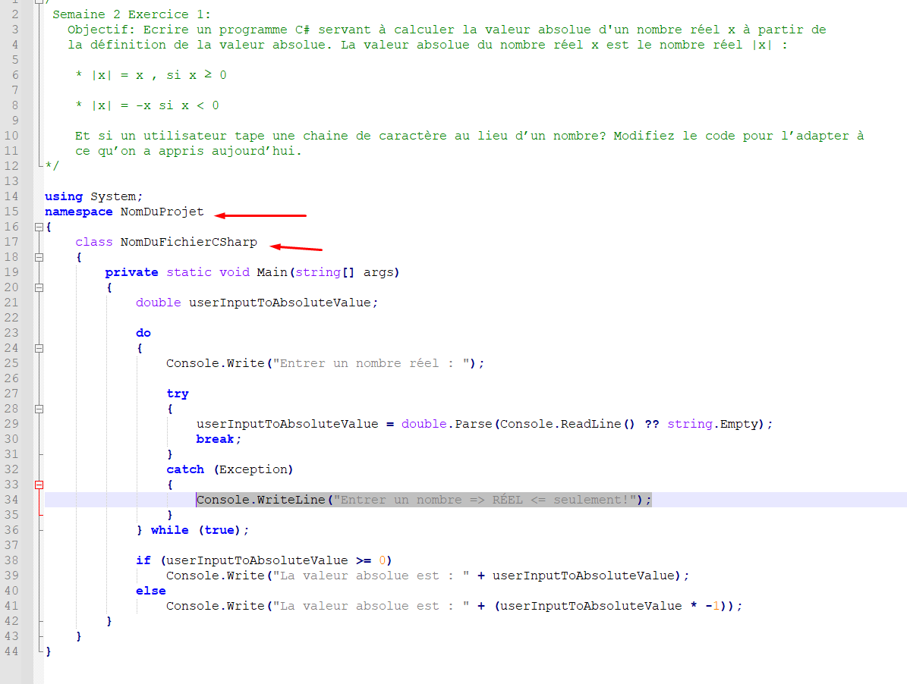
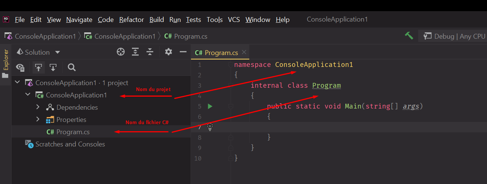

# Assurance Qualité Logiciel

Pour exécuter le code dans ce répertoire :
1. Créer une nouvelle solution sur visual studio
2. Copier le code d'un fichier source dans le répertoire et le coller 
   dans votre fichier csharp.
3. CTRL + F -> **NomDuProjet** et changer pour le nom de votre projet.
4. CTRL + F -> **NomDuFichierCSharp** et changer pour le nom de votre fichier.
5. Done ! :sunglasses:

   