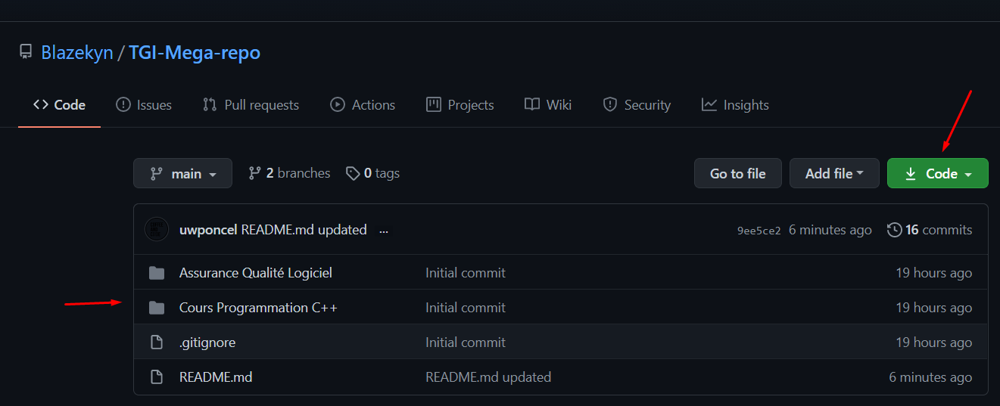

# TGI Mega Repo

### **Bienvenue sur le répertoire de TGI ! :rocket:**

Ce répertoire a pour but de permettre aux étudiants de collaborer et de mieux se préparer aux examens en partageant des solutions à des exercices / devoirs. 
En programmation il y a plusieurs façons d'interpréter le code et peut-être qu'un de ces solutionnaires vous aidera.

**Tout le monde peux collaborer ! :raised_hands:**

***

### **Welcome to the TGI repository ! :rocket:**

This repository aims to allow students to collaborate and better prepare for exams by sharing solutions to exercises / homework.
In programming there are many ways to interpret the code and maybe one of these solutions will help you.

**Everyone can collaborate ! :raised_hands:**

## Discord server
Come chat with us !

## Utilisation / Usage :computer:
- Pour consulter le code vous pouvez simplement cliquer sur les dossiers en question.

- Pour télécharger l'ensemble d'un répertoire, cliquer sur le button **Download ZIP**.

***

- To consult the code you can simply click on the files in question.

- To download the entire repository, click on the **Download ZIP** button.

## Contribution / Contributing :handshake:

#### Vous pouvez contribuer au répertoire de deux manières :

1. Envoyer votre fichier directement à Alex ou William.
2. Faire un pull request sur le répertoire ou nous réviserons les changements avant de merge.
    * Les pull requests sont les bienvenues.
      Pour les changements majeurs, veuillez d'abord ouvrir une 'issue' pour discuter de ce que vous souhaitez changer.

Pour plus d'informations sur comment effectuer un pull request consulter le lien [ici](https://opensource.com/article/19/7/create-pull-request-github).

***

#### You can contribute to the directory in two ways:
1. Send your file directly to Alex or William.
2. Do a pull request on the directory where we will review the changes before merge.
    * Pull requests are welcome. For major changes, please open an 'issue' first to discuss what you want to change.

For more information on how to perform a pull request see the link [here](https://opensource.com/article/19/7/create-pull-request-github).

## License
[MIT](https://choosealicense.com/licenses/mit/)
